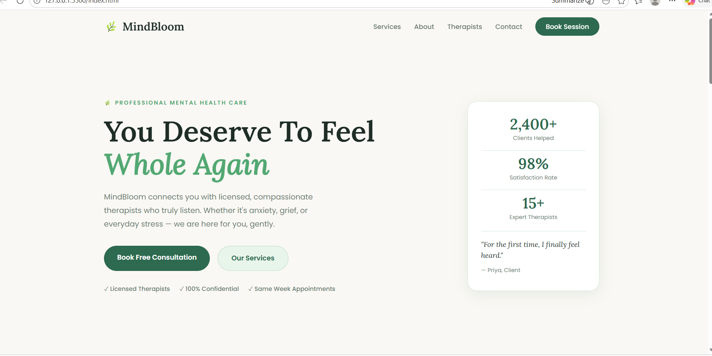
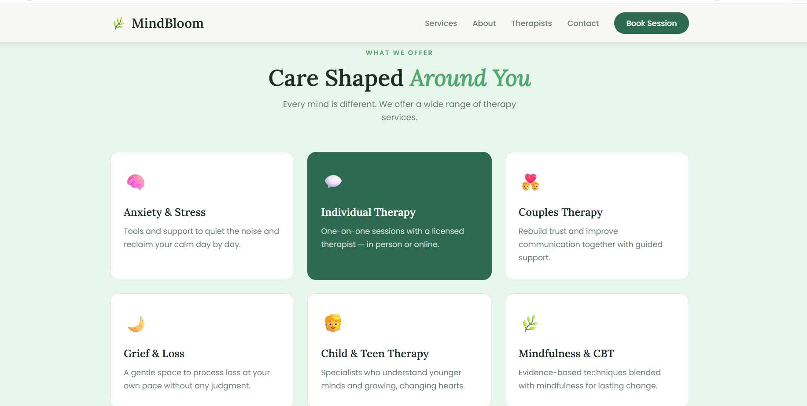
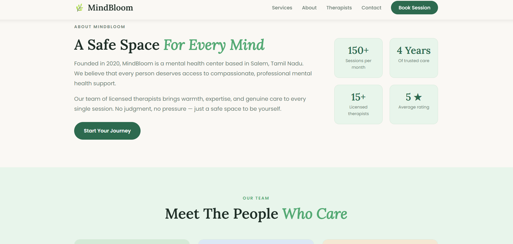
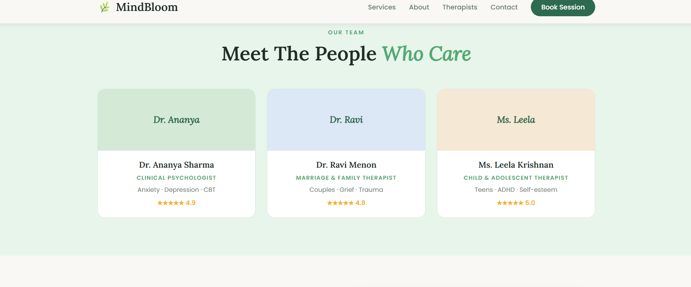
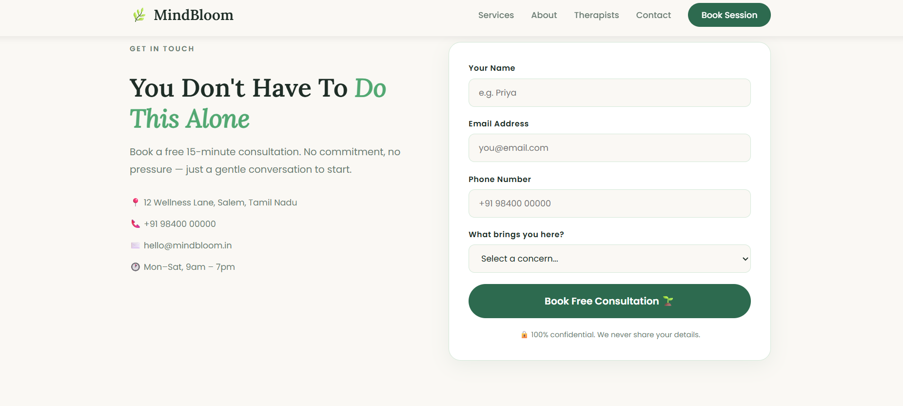

🌿 MindBloom - Mental Health & Therapy Website

---

## 🎯 Objective

The objective of this project is to design and develop a responsive mental health website called MindBloom. It helps users explore therapy services and book consultation sessions.

---

## 🛠 Technologies Used

* HTML
* CSS
* JavaScript

---

## 📂 Project Structure

* index.html
* style.css
* README.md

---

## 🚀 Features

* Responsive design
* Navigation bar with hamburger menu
* Services section
* Therapists section
* Contact form
* Footer with social links

---

## ▶️ How to Run

Open the index.html file in any web browser.

---

## 📸 Output

## 📚 What I Learned

* HTML structure
* CSS styling and responsive design
* Basic JavaScript
* GitHub usage

---
ealth Website
